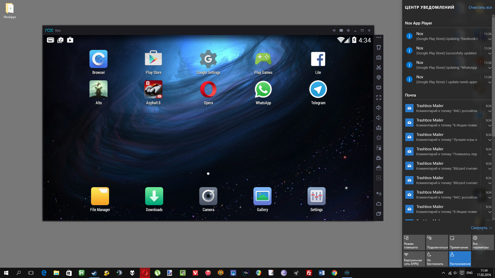
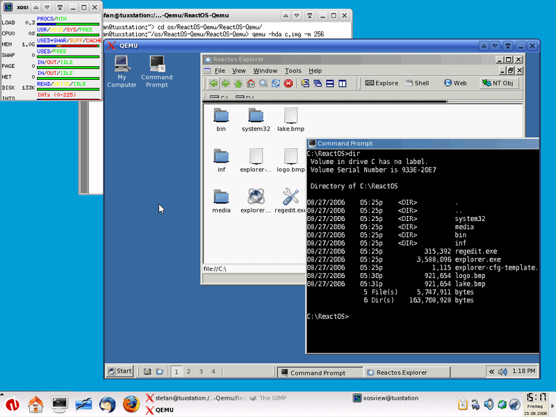
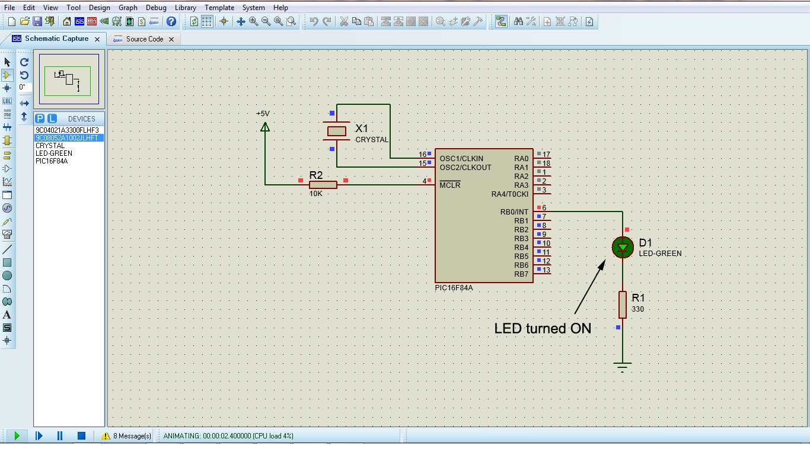
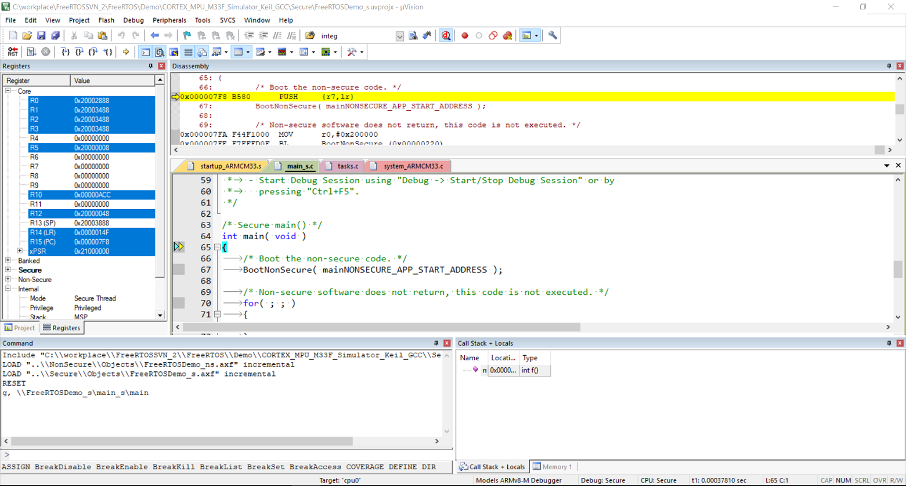

# Сравнительный анализ современных языков программирования для разработки эмулятора аппаратных архитектур

## Введение

​При проектировании программного обеспечения всегда встает вопрос о том какой язык программирования выбрать. Для разработки современного программного обеспечения используется большое количество языков программирования. Согласно рейтингу языков программирования на индексе TIOBE в настоящее время около 50-ти языков занимают хотя бы 0.1% доли рынка. Очевидно, что среди них нет наилучшего языка, так как у каждого из них есть своя область применения, своя философия, особенности, различные диалекты и фреймворки. Все это добавляет ещё больше вариантов при выборе языка для написания программного обеспечения. Помимо этого, у языков существует ещё множество других аспектов, по которым можно производить их сравнение. Таким образом, выбор языка программирования для написания современного программного обеспечения  является комплексной задачей с большим количеством критериев, по которым необходимо производить оценку.

​Правильный выбор средств и инструментов при разработке оказывает существенное влияние на процесс выполнения, качество результата и возможность дальнейшей поддержки любого проекта, особенно для различных критических систем. Для уменьшения числа вариантов при выборе языка программирования необходимо отталкиваться от программного продукта, который разработчик хочет получить в конечно итоге. Для этого необходимо оценить набор критериев, которыми должен обладать разрабатываемый продукт. *Примерами таких критериев являются: скорость исполнения, переносимость, среда исполнения, масштабируемость, качество экосистемы, наличие встроенных средств и абстракций.(мейби перенести на потом)*

​Хотя большинство языков являются и универсальными, но некоторые из них являются более подходящими для конкретных целей, нежели другие. Например язык JavaScript отлично подходит для разработки web-приложений, так как имеет готовую экосистему для этого и превосходную переносимость, которая в контексте web-приложений категорически необходима, ведь весь код JavaScript исполняется на персональном компьютере пользователя. С другой стороны он совсем не подходит для решения задач системного программирования из-за того, что является интерпритируемым языком и обладает недостаточными для системного программирования быстродействием.

​Таким образом языки можно условно разделить по распространенным задачам, для решения которых они подходят лучше всего. Но что если задача, которую должен решать разрабатываемый программный продукт не является распространенной. Для таких задач нет готовых решений, средств и абстракций, которые бы упростили разработку программного продукта. В связи с этим возникает необходимость в проведении сравнительного анализа языков программирования, для выявления наиболее подходящего для поставленной задачи.

## Задача эмуляции аппаратной архитектуры

​В процессе проектирования электронных устройств часто возникает потребность в тестировании их работоспособности. Отладка разрабатываемого программного обеспечения на самом устройстве в большинстве случаев невозможна в связи с недоступностью устройства или отсутствия на нем необходимых аппаратных частей, которые ещё находятся в процессе проектирования. Тестирование работы программного обеспечения для разрабатываемого устройства на персональном компьютере разработчика в части случаев невозможна из-за различий в аппаратной архитектуре процессора, периферии и окружении. Исходя из этого можно сделать вывод о востребованности решения, которое способно  проводить отладку программного обеспечения для устройства без доступа к самому устройству.

​Для решения данной проблемы используются эмуляторы - программные средства, которые имитируют функции устройства и его окружения в другой вычислительной системе, чтобы эмулированное поведение максимально близко соответствовало поведению настоящего устройства.  Данные средства позволяют на одной компьютерной системе, называемой хостом, запускать программы, написанные для другой системы, называемой гостем. Например, на рисунке 1 представлена эмуляция мобильного устройства под управлением операционной системы семейства "Android" на персональном компьютере под управлением операционной системы семейства "Windows"

{width=70%}

Рисунок 1 - Эмуляция мобильного устройства на персональном компьютере

​История появления эмуляторов связна с развитием компьютеров и появлением новых архитектур. С появлением новой более совершенной архитектуры возникла проблема обратной совместимости программного обеспечения. Разработчикам операционных систем было невыгодно переписывать программные средства под новую архитектуру персонального компьютера. Для решения данной проблемы был разработан эмулятор, который позволял запускать старые программные средства на персональном компьютере с новой архитектурой.

## Применение

​Сфера применения эмуляторов достаточно обширна. Они используются в процессе разработки как небольших аппаратно-цифровых устройств, так и массивных программно-аппаратных комплексов. Это связано с типичными проблемами аппаратной разработки, такими как отсутствие полностью рабочей аппаратной части или опасность нанесения ущерба в случае неправильного функционирования устройства. Эмулятор позволяет решить данные проблемы за счет полной программной имитации поведения разрабатываемого устройства, позволяя разработчику отлаживаться без наличия аппаратной части в принципе.

​Помимо разработки эмуляторы применяются при проведении исследований и реверс-инжиниринга работы различных встраиваемых устройств. При отсутствии исходного кода возникают трудности при проведении анализа работы внутреннего программного обеспечения устройства. Анализ бинарного кода, собранного под системы персональных компьютеров как правило, не вызывает никаких затруднений на самом раннем его этапе, поскольку объект анализа полностью доступен. В процессе работы устройства часть данных, которые которые обрабатываются во внутреннем программном обеспечении, генерируются только в процессе его работы. При этом на устройстве не предусмотрено возможности для получения их пользователем. В связи с этим возникает проблема получения некоторой части данных, которые нельзя найти обычным статическим анализом кода. С помощью эмулятора можно запустить работу устройства на другой системе и получить доступ ко всем имеющимся внутри данным, в том числе к тем, которые генерируются в процессе работы, а также к данным регистров и памяти. Стоит отметить, что таким же образом эмулятор применяется для поиска уязвимостей во внутреннем программном обеспечении исследуемого устройства. Для этого к нему добавляется программное средство для проведения фаззинг-тестирования, которое передает на вход устройству неправильные, неожиданные или полностью случайные данные. За счет полного доступ ко всем частям работающего устройства внутри эмулятора можно отслеживать состояния работы его внутреннего программного обеспечения. Все это позволяет фиксировать отказ в обслуживании устройства и находить ранее неизвестные уязвимости.

## Обзор существующих решений

**Qemu (Quick Emulator)** - инструмент с открытым исходным кодом, который используется для эмуляции различных архитектур. Qemu имеет большое сообщество разработчиков и, как следствие, хорошую поддержку сообщества разработчиков. Поддерживает два режима эмуляции: пользовательский режим, в котором происходит полная эмуляция системы, включая процессор и периферию, и системный режим в котором происходит только трансляция инструкций и системных вызовов эмулируемой системы. На рисунке 2 приведен пример работы Qemu в системном режиме, где происходит эмуляция операционной системы ReactOS

{width=550px}

Рисунок 2 - Эмуляций операционной системы ReactOS в эмуляторе Qemu

Qemu обладает такими положительными характеристиками, как наличие интерфейса RSP GDB, моделирование на основе логического соединения шин и высокое быстродействие, так как написан на языке С. С другой стороны это создает большой недостаток в виде высокой сложности написания новых модулей (архитектур, периферии и т.д.).

**Proteus** - пакет программ для автоматизированного проектирования электронных схем, отличительной чертой которого является возможность моделирования работы программируемых устройств (рисунок 3). Эмуляция в Proteus, в отличие от Qemu происходит на уровне электрических сигналов, что значительно замедляет ее скорость.

{width=546px}

Рисунок 3 - Эмуляция работы микроконтроллера семейства PIC16 в Proteus

Является проприетарным программным обеспечением, но присутствует возможность написания собственных модулей на C++. С этим связаны различные проблемы, такие как отсутствие подробной документации, слабая поддержка пользователей в сообществе разработчиков и специфика языка С++.

**Эмуляторы, встроенные в IDE** - некоторые IDE, например ARM Keil имеют встроенный эмулятор аппаратных платформ (рисунок 4). Такие эмуляторы имеют слабую поддержку сообщества разработчиков, медленны в работе и практически неприменимы в задачах разработки и реверс-инжиниринга встроенных систем. Это связано с отсутствием в таких эмуляторах возможности эмулировать периферийные устройства, которые являются обязательной составляющей любой встраиваемой системы.

{width=489px}

Рисунок 4 - Эмуляция работы ядра ARM Cortex-M33 в IDE Keil uVision

## Постановка задачи

В итоге рассмотрения данного вопроса можно сказать, что существующие решения для проведения эмуляции аппаратных платформ не обладают характеристикой быстродействия и возможностью простой реализации новых модулей одновременно. При высокой скорости работы таких языков как C/C++ они обладают малым количеством встроенных средств и абстракций, слабо развиты и часто имеют не интуитивное поведение. Таким образом возникает потребность в разработке эмулятора, который будет обладать высокими характеристиками быстродействия и удобством реализации новых модулей. Основной составным элементом программного обеспечения, от которого зависят данные характеристики является язык программирования, на котором ведут разработку. Также важной составляющей является архитектурная реализация эмулятора.

Производить оценку и сравнение архитектурных реализаций крайне сложная и многокритериальная задача, так как она зависит от множества входных данных, которые будут подаваться на вход эмулятора, и оценить все их нецелесообразно.

Объективно оценить языки программирования по критериям поддерживаемых абстракций, специальных средств и удобства в целом невозможно. Здесь также влияют огромное количество параметров, таких как специфика языка, его целевая область применения, субъективные предпочтения разработчика и т.д. Таким образом, выбор языков программирования по данному пункту был произведен на основе мнения сообщества разработчиков о возможностях различных языков.

В отличии от предыдущих критериев, объективно оценить характеристику быстродействия языка программирования возможно. Для этого необходимо разработать идентичные тесты на рассматриваемых языках программирования и провести измерение их времени исполнения.

Для проведения тестирования были подобраны следующие языки программирования:

* 

## Выбор тестов для сравнения

## Результаты сравнения

## Выводы